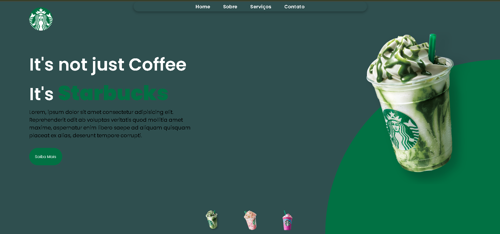

Projeto Starbucks
Este é um projeto de página do Starbucks inspirado em uma aula do Dev Club, com algumas modificações e toques pessoais.

💻 Tecnologias utilizadas
HTML

CSS

JavaScript

🎯 Objetivo do projeto
O objetivo principal foi praticar a construção de uma interface web moderna e responsiva, aplicando conhecimentos em HTML, CSS e JavaScript, além de explorar interações básicas com o usuário.

🛠️ O que foi modificado
Alterações no layout e nas cores para dar um toque pessoal

Ajustes na responsividade para melhor adaptação em diferentes telas

